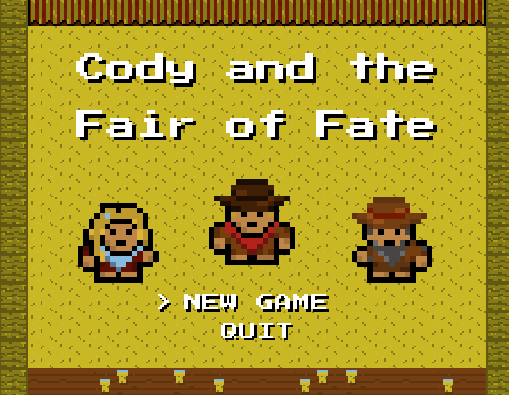
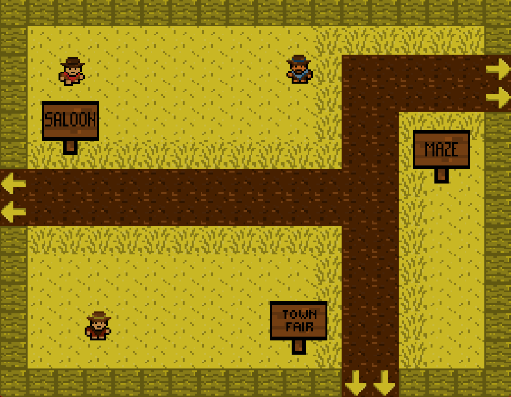
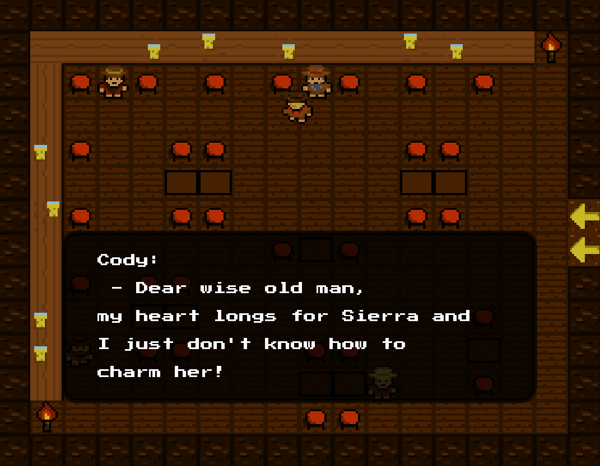
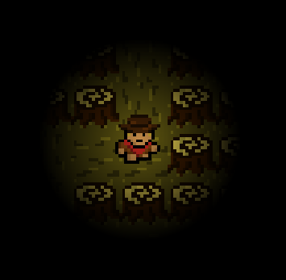
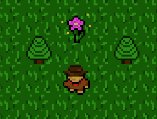
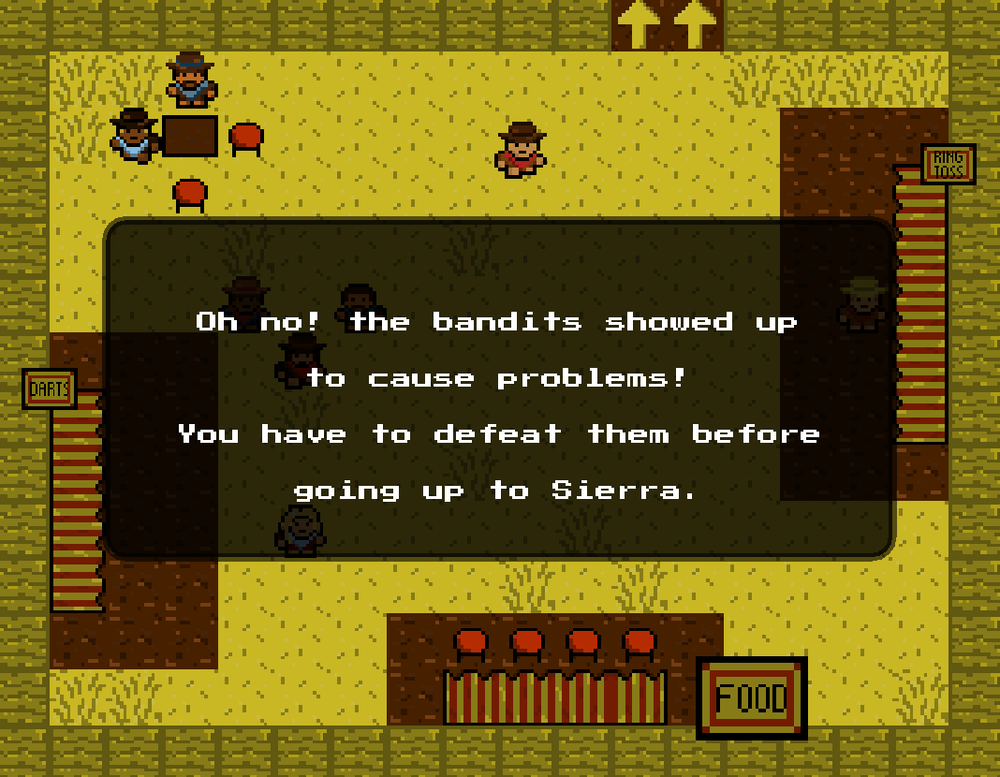

# Cody and the Fair of Fate

A 2D story-driven adventure game built in Java (Swing).

Cody is a cowboy in love, but before he can confess his feelings to Sierra, he must complete a series of challenges designed to prove his courage.

This project is a complete 2D adventure game featuring multiple scenes, state-driven gameplay, dynamic enemy AI with pathfinding, collision-based interactions, and dialogue systems.

## Gameplay Overview

The player must:

- Escape the Enchanted Maze (with dynamic lighting)
- Collect magical wildflowers under time pressure
- Defeat the Bandit Leader in an arena battle
- Interact with NPCs and progress through dialogue

## Controls

Move: W / A / S / D
Attack: Space
Advance dialog: Enter
Pause: P

## Technical Features

- Custom game loop - 60 FPS
- State-based architecture
- A* pathfinding implementation
- Dynamic radial lightning system (in maze scene)
- Tile-based maps loaded from text files
- Sprite animation (multi-frame movement)
- Collision detection using hitboxes
- Sound engine with background music and effects
- Modular object-oriented architecture

## Architecture
The project follows a modular design:
- mainLogic: core game engine, state management, rendering, UI, sound
- entity: player, NPCs, enemy
- object: interactive world objects (flowers, torches, signs, hearts)
- environment: light management
- tiles: tile and map rendering system
- pathfinder: A* pathfinding implementation

## Screenshots

Title page:

  

Main scene:

  

Saloon scene:

  

Maze challenge:

  

Flower picking challenge:

  

Fair scene:

  

